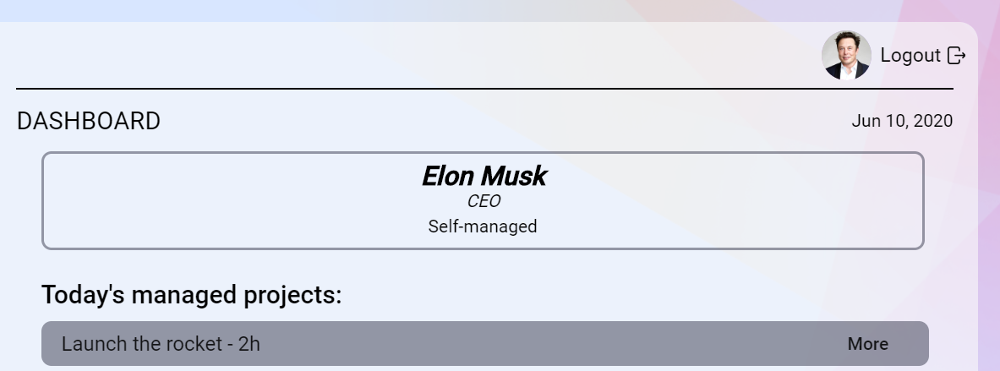
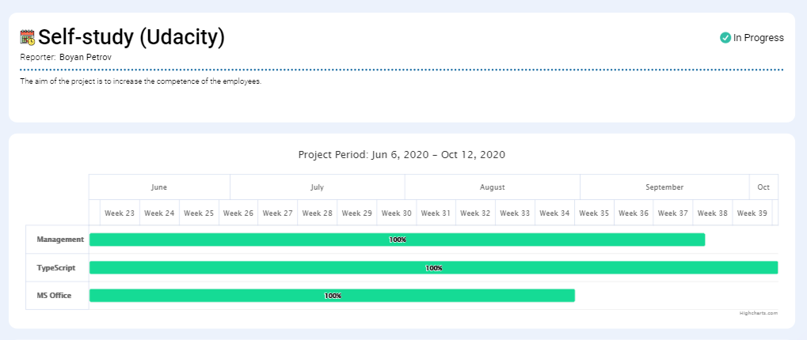
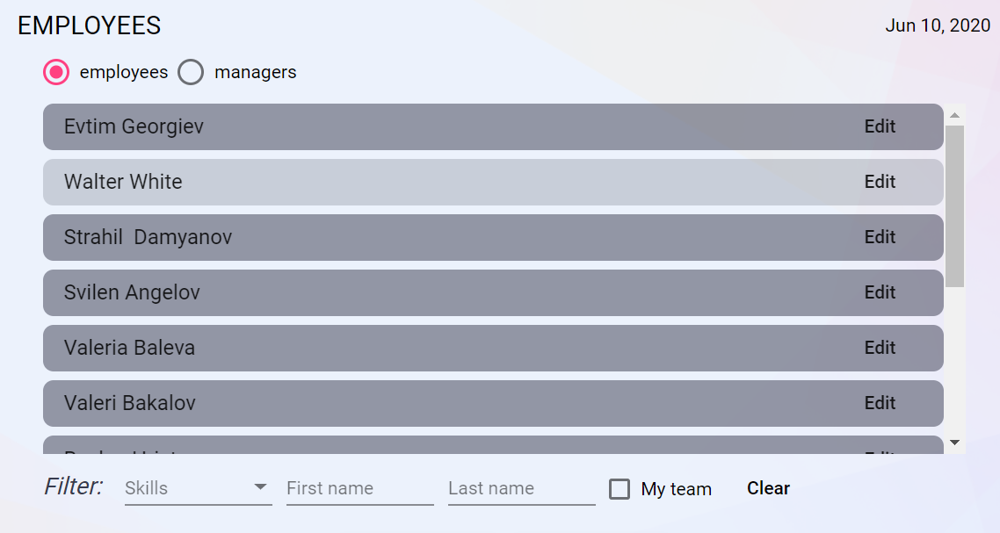
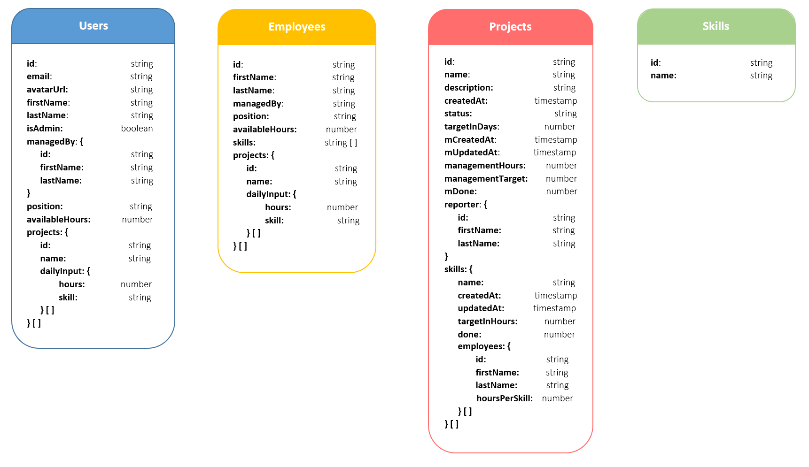
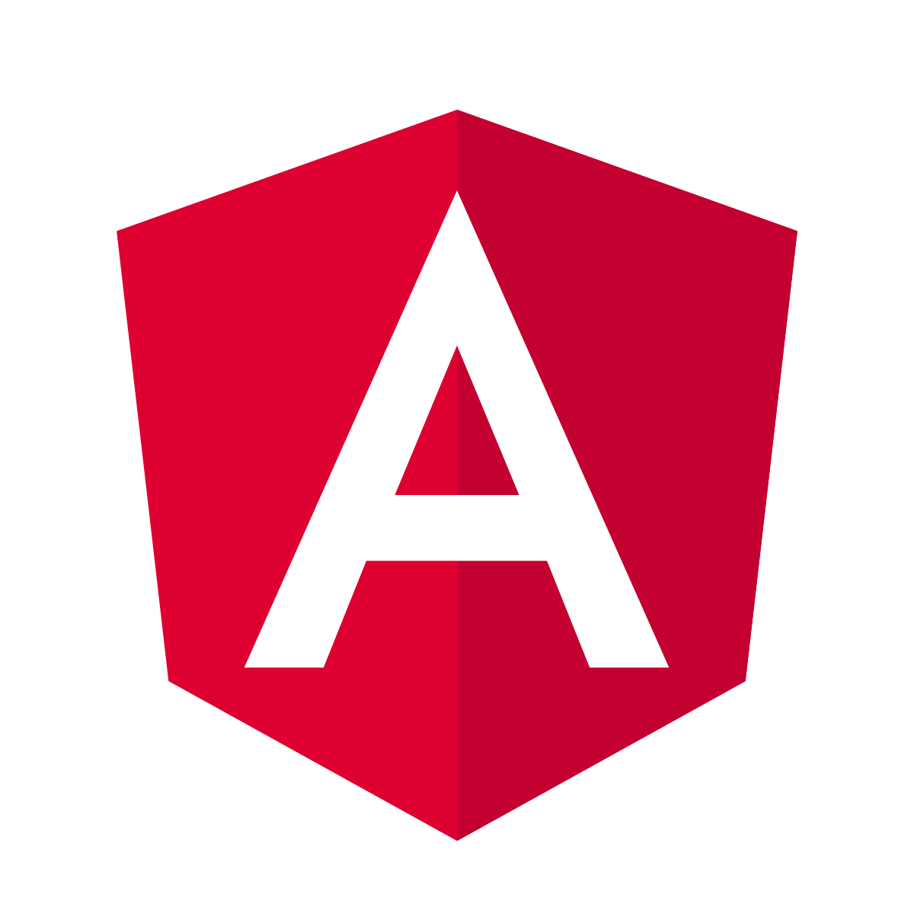

# 
  </br>
  <h4><i>
A Telerik Academy students project on typescript, generated with Angular CLI version 9.1.4.
</i></h4>


Proptimize is a Project Planning System, designed to support managers in their day to day operations. It allows registered users to create and easily manage new projects, assign tasks, distribute available human resources, track deadlines & more.
This app aims to deliver intuitive design and quality service through user-friendly interface. 

**Official link**: https://proptimize-edb90.web.app/ 

<h2>Team</h2>

This project is being developed by <a href="https://gitlab.com/0ligotann">Tanya</a> and <a href="https://gitlab.com/nkoev">Nikolay</a>,
proud Bulgaria's Telerik Academy students under the guidance of Kiril Parushev from Tick 42, our technical trainers Edward Evlogiev, Rosen Urkov and Stoyan Peshev and the inestimable mental support of Boyan Hadjiev.

<h2>Features</h2>
The system is accessible through successful authentication. It is accessible both by regular users and administrators, which are basically regular users (managers) with extra capabilities.


___




<br>

**Regular User** (```login: boyan@proptimize.com, pass: 123456```)
  - Login & logout
  - Dashboard
    - overview of the state of the manager
    - “today’s managed projects”
  - Projects page
    - all company projects
    - filtering by status, reporter name etc.
    - dedicated project page for each project
    - new project creation
  - Emlpoyees page
    - list of all employees
    - list of all managers
    - filtering by name, competence etc.
    - dedicated profile page for each employee

**Administrator** (```login elon@proptimize.com, pass: 123456```)
  - Register new users
    - emlpoyees
    - managers
    - admins
  - Update existing users
    - add skills from the available set
  - Skills page
    - all skills that are registered with the system
    - add new skills

<h2>Requirements</h2>

You need **node.js** with **npm** on your machine. 

<h2>Installation</h2>

<p>This app will install all required dependencies automatically. Just start the commands below in the root folder where you can find the package.json file.</p>

```
$ npm install
```
<h2>DB Schema</h2>

The database is created with **Cloud Firestore** - a flexible, scalable database for mobile, web, and server development from Firebase and Google Cloud Platform. The following diagramm represents the db structure:



<h2>Run Application and start development Server</h2>

To run this app in your browser just start everything with the command below in the applications root folder. It will start the app on http://localhost:4200/ .

```
$ npm start
```

<h2>Run Tests</h2>

All unit tests are performed with **jest**. Run command below to execute all unit test:

```
$ npm run test
```

<h2>Tech Stack</h2>

  -  Angular 9
  -  Cloud Firestore
  - Jest
  - Google charts
  - Highcharts
